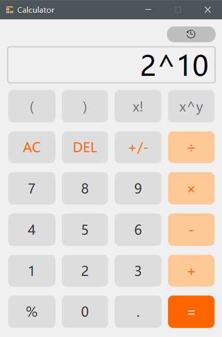
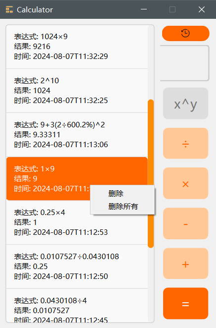

## 概述

基于 **C++** 和 **Qt** 框架开发的简单的计算器应用，采用 **QSS** 实现可定制的界面样式。支持历史记录管理，并将记录存储在 **SQLite** 数据库中。采用 **代码化UI设计**，没有使用到UI文件。

## 功能

1. **基本计算**：
   - 支持加法、减法、乘法、除法等基本运算。
   - 处理括号和阶乘等高级算术操作。

2. **侧边栏**：
   - 动态显示或隐藏历史记录。

3. **历史记录**：
   - 可查看过往计算，包括表达式、结果和时间戳。
   - 可以将历史结果添加至输入面板中，方便重新计算。
   - 支持删除某条历史记录或清空所有历史记录。

4. **控制字符串的显示**：
   - 实时反馈输入，并尽量确保表达式合法。

5. **补全字符串**：
   - 处理结果时补全用户输入，避免语法错误，保持表达式有效。

7. **计算由字符串转换而来的后缀表达式**：
   - 中缀表达式转换为后缀表达式，返回最终结果并加入历史记录。
  
## 效果

